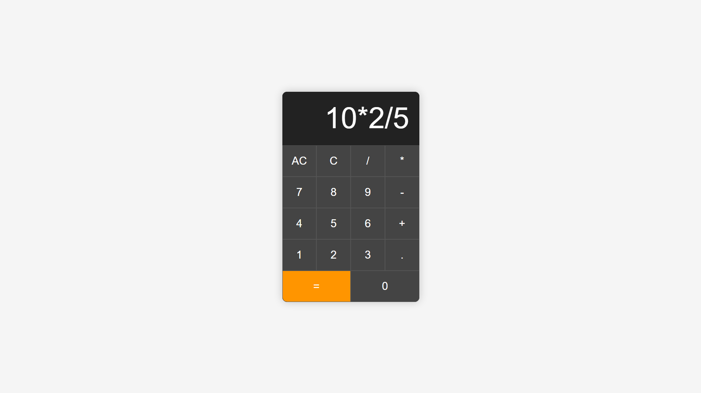

# Calculator App

**Calculator App** is a simple yet powerful web application that performs basic arithmetic operations like addition, subtraction, multiplication, and division. Built with HTML, CSS, and JavaScript, this app features a clean, intuitive interface and responsive design, making it easy to use on any device. Ideal for quick calculations on the go.

## Features

- **Basic Arithmetic Operations**: Perform addition, subtraction, multiplication, and division.
- **Clear Function**: Clear the current input or all inputs.
- **Responsive Design**: Adapts to different screen sizes for optimal viewing on any device.
- **User-Friendly Interface**: Simple and clean design for ease of use.

## Demo



## Getting Started

Follow these instructions to get a copy of the project up and running on your local machine.

### Prerequisites

You will need a modern web browser to view and interact with the app.

### Installation

1. Clone the repository:
   ```sh
   git clone https://github.com/HannanDeveloper01/calculator.git
